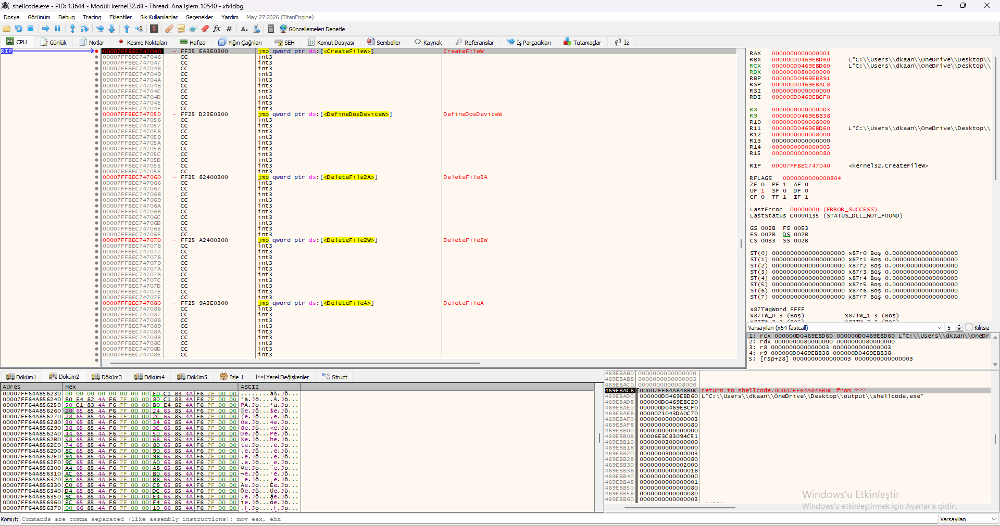
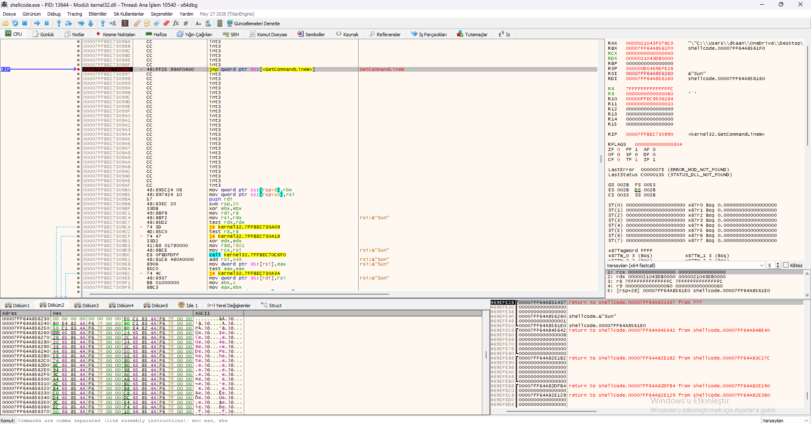
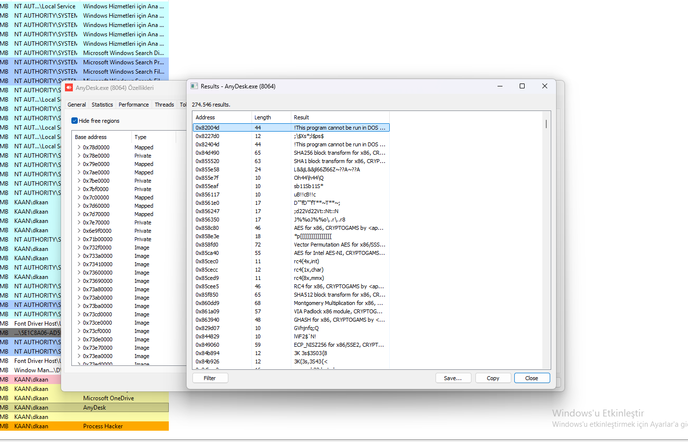
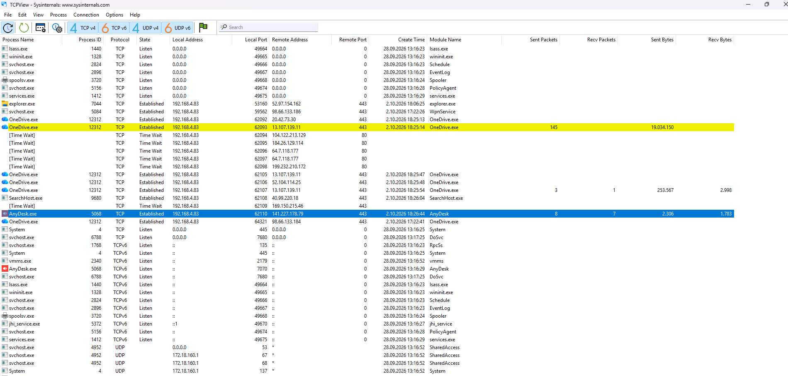
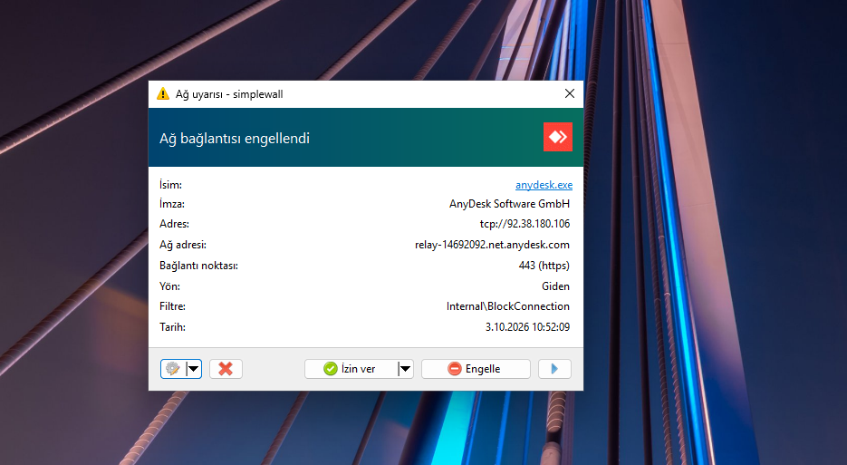
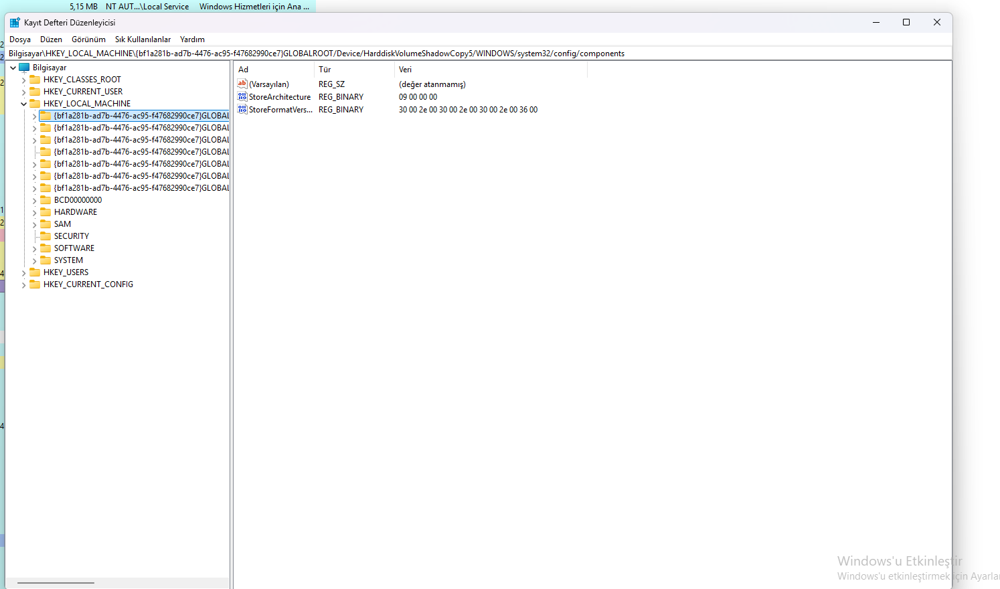

## 1.x64dbg – File Operations & JMP Trampolines

This x64dbg view reveals that the Python shellcode uses file operations (`CreateFileW`, `DeleteFileA/W`) and JMP trampolines to dynamically call Windows APIs.

### Key Observations:

- **`CreateFileW`** – Creates or opens a file (payload drop).
- **`DeleteFileA` / `DeleteFileW`** – Deletes files (trace cleanup).
- **`DefineDosDeviceW`** – Defines a DOS device (drive manipulation).
- **JMP Trampolines:** `jmp qword ptr ds:[<API>]` – dynamically resolves API addresses.
- **`INT3` (0xCC)** – Anti-debug traps.
- **Shellcode Path:** `C:\Users\dkaan\OneDrive\Desktop\output\shellcode.exe`.

### Why This Matters:

- **File Dropping:** The shellcode writes itself to disk.
- **Trace Cleanup:** Deletes files to avoid detection.
- **Dynamic API Resolution:** JMP trampolines resolve APIs at runtime.
- **Anti-Debug:** INT3 traps disrupt debuggers.

### Visual Reference:

*x64dbg view showing `CreateFileW`, `DeleteFileA/W`, and JMP trampolines.*

## 2. x64dbg – GetCommandLineW, INT3 Traps & Command-Line Parsing

This x64dbg view reveals that the Python shellcode calls `GetCommandLineW` to read command-line arguments, while using INT3 traps for anti-debugging.

### Key Observations:

- **`jmp qword ptr ds:[<GetCommandLineW>]`** – JMP trampoline to `GetCommandLineW`.
- **`&"Sun"`** – A command-line argument string.
- **INT3 Traps (0xCC)** – Fills the memory space between valid instructions, disrupting debuggers and disassemblers.
- **Function Prologue:** `mov [rsp+8], rbx`, `sub rsp, 0x20`, `xor ebx, ebx`.
- **Conditional Branch:** `test rdx, rdx`, `je kernel32.7FFBEC730A9`.
- **Parameter Preparation:** `mov rdx, rsi`, `mov r8, rdi`.

### Why This Matters:

- **Anti-Debugging:** INT3 traps cause debuggers to break or crash.
- **Anti-Disassembly:** Disassemblers show INT3 as invalid instructions.
- **Command-Line Parsing:** The shellcode reads its command-line arguments.
- **Dynamic API Resolution:** JMP trampolines resolve `GetCommandLineW` at runtime.

### Visual Reference:

*x64dbg view showing `GetCommandLineW`, command-line parsing, and INT3 traps.*

## 3. AnyDesk APC Injection & Cryptographic Operations

Process Hacker memory analysis reveals that the Python shellcode performs **APC Injection** into `AnyDesk.exe` and uses advanced cryptographic algorithms for data exfiltration.

### APC Injection – Why AnyDesk?

- **Target Process:** `AnyDesk.exe` (PID 8064) – a legitimate remote desktop tool.
- **Injection Method:** APC (Asynchronous Procedure Call) injection – injects code into an existing thread without creating a new one.
- **Why AnyDesk?** 
  - It is a trusted, always-running process.
  - Its network traffic (remote desktop) blends with C2 communication.
  - Security tools rarely flag AnyDesk activity.

### Cryptographic Algorithms:

- **`AES for x86` / `AES for Intel AES-NI`** – symmetric encryption.
- **`RSA for x86`** – asymmetric encryption.
- **`SHA256 block transform`** – hashing.
- **`RC4 for x86`** – stream cipher.
- **`Vector Permutation AES`** – SIMD-accelerated AES.
- **`GHASH for x86`** – GCM authentication.
- **`Montgomery Multiplication`** – RSA acceleration.
- **`ECP_NISTZ256 for x86`** – elliptic curve cryptography.

### Why This Matters:

- **APC Injection:** Stealthier than `CreateRemoteThread` – no new thread is created.
- **LOLBin Abuse:** AnyDesk is a legitimate tool, making detection harder.
- **Encrypted C2:** The shellcode encrypts its communication with AES/RSA.
- **Data Integrity:** SHA256 and GHASH ensure data is not tampered with.

### Visual Reference:

*Process Hacker view showing AnyDesk injection and cryptographic algorithms (AES, RSA, SHA256, RC4).*

## 4. TCPView – AnyDesk Data Exfiltration

TCPView analysis reveals that the Python shellcode uses `AnyDesk.exe` to exfiltrate data to `141.227.178.79` over port 443 (HTTPS).

### Key Observations:

- **Process:** `AnyDesk.exe` (PID 5068) – legitimate remote desktop tool.
- **Remote IP:** `141.227.178.79`
- **Port:** `443` (HTTPS – blends with legitimate traffic).
- **State:** `Established` (active connection).
- **Sent Packets:** 8 (2,306 bytes) – encrypted data exfiltration.
- **Recv Packets:** 7 (1,703 bytes) – C2 commands.

### Why This Matters:

- **LOLBin Abuse:** AnyDesk is a legitimate tool, making detection harder.
- **Encrypted Exfiltration:** Port 443 (HTTPS) hides the stolen data.
- **C2 Communication:** The shellcode receives commands from the same IP.
- **Evasion:** Security tools rarely flag AnyDesk traffic.

### Visual Reference:

*TCPView view showing AnyDesk.exe connecting to 141.227.178.79 over port 443.*

## 5.AnyDesk - Simplewall blocking remote IP addresses

Simplewall analysis reveals that although the Python shellcode attempts to exfiltrate data to `141.227.178.79` via port 443 (HTTPS) using `AnyDesk.exe`, it tries to establish a connection to another legitimate address (`92.38.180.106`) when blocked.

### Key  Observations:

- **Process:** `AnyDesk.exe` (PID 5068) – legitimate remote desktop tool.
- **Remote IP:** `92.38.180.106`
- **Port:** `443` (HTTPS – blends with legitimate traffic).
- **State:** `Blocked` (blocked connection).
- **blocked address:** (relay-14692092.net.anydesk.com).

### Why This Matters:

- **LOLBin Abuse:** AnyDesk is a legitimate tool, making detection harder.
- **Encrypted Exfiltration:** Port 443 (HTTPS) hides the stolen data.
- **C2 Communication:** The shellcode receives commands from the same IP.
- **Evasion:** Security tools rarely flag AnyDesk traffic.

### Visual Reference:

*Simplewall wiew showing Anydesk.exe blocked to 92.38.180.106 over port 443.*

## 6. Registry Persistence – GUID-Based Keys

Registry analysis reveals that the Python shellcode creates GUID-based keys under `HKLM\SYSTEM\CurrentControlSet\Control\` for persistence.

### Key Observations:

- **GUID Keys:** `{bf1a281b-ad7b-4476-ac95-f47682990ce7}` – randomly generated GUIDs.
- **Volume Shadow Copy Path:** `GLOBALROOT\Device\HarddiskVolumeShadowCopy5\WINDOWS\system32\config\components`.
- **StoreArchitecture:** `09 00 00 00` – architecture identifier.
- **StoreFormatVersion:** `30 00 2e 00 30 00 2e 00 2e 00 36 00` – "0.0.0.6" in Unicode.

### Why This Matters:

- **Persistence:** GUID keys ensure the shellcode runs on system startup.
- **Stealth:** Volume Shadow Copy paths are rarely monitored.
- **Evasion:** Random GUIDs make detection harder.

### Visual Reference:

*Registry Editor view showing GUID-based keys and StoreFormatVersion values.*

## Conclusion

This analysis revealed an advanced Python shellcode that injects into AnyDesk via APC injection, establishes a connection to the C2 server using AnyDesk's legitimate IP addresses, and conceals traffic using AES and RSA encryption algorithms.

### Key Takeaways:

- **It has been revealed that AnyDesk was exfiltrating data to the IP address `141.227.178.79`, as observed in TCPView.
- **The shellcode injects itself into AnyDesk—a legitimate process—using the APC injection technique, making the malware difficult to detect.
- **AnyDesk employs high-level encryption algorithms, such as AES and RSA, to encrypt C2 communication and conceal network traffic.
- **To ensure persistence and hinder detection, the Python shellcode leaves traces in the Registry using GUID-based keys pointing to the volume shadow copy path: `GLOBALROOT\Device\HarddiskVolumeShadowCopy5\WINDOWS\system32\config\components`.
- **In x64dbg, there are attempts to create files and delete traces—such as calls to CreateFileW and DeleteFileA. Additionally, `int3` traps frequently appear, intended to hinder analysis.

### Sample Download

The analyzed Formbook sample is available on MalwareBazaar for those who wish to conduct their own analysis:

**[Python Shellcode Sample on MalwareBazaar](https://bazaar.abuse.ch/sample/53b9d801349be358960d5be9c3b5d153e44bbd155bccb7e5fa3318647b6b8b51/)**

**Tools Used:** x64dbg, Process Hacker, Binary Ninja

